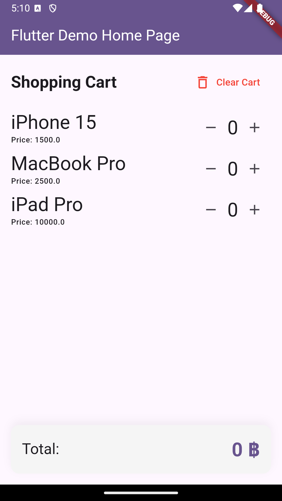

# shopping_cart

A shopping cart application. used to practice state management in flutter.



## Getting Started

install flutter package using the following command:

```bash
flutter pub get
```

run the app using the following command:

```bash
flutter run
```
